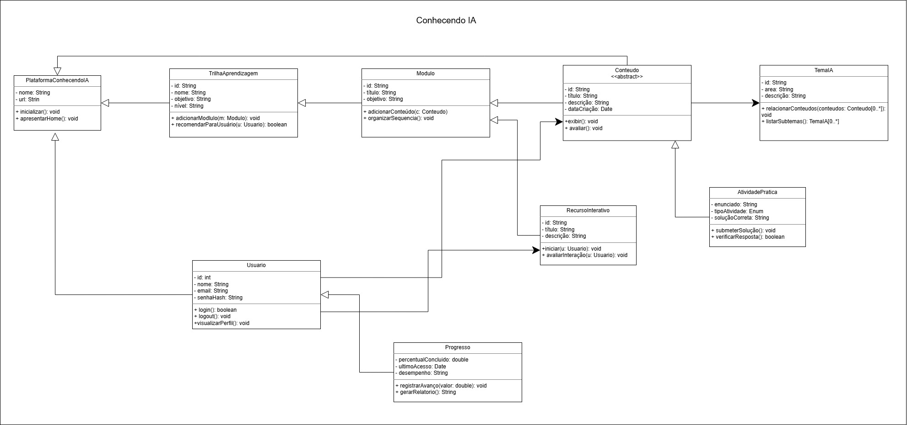

# 2.1.1 Diagrama de Classes 

## Introdução

O Diagrama de Classes detalha a estrutura estática do sistema ConhecendoIA, estabelecendo as especificações das classes de software, suas interfaces e as relações de colaboração necessárias para atender aos requisitos funcionais. Diferente de um modelo puramente conceitual, esta modelagem foca na perspectiva de projeto, definindo tipos de dados, métodos e a visibilidade de atributos (públicos ou privados), elementos essenciais para a tradução da lógica de negócio em código executável. Segundo Larman (2007), este diagrama ilustra as especificações técnicas que orientam a implementação, permitindo uma visão clara de como os objetos de software interagem entre si para sustentar as funcionalidades de trilhas de aprendizagem e interação social da plataforma.

## Metodologia

A construção do diagrama para o portal Conhecendo IA foi realizada através de uma análise profunda dos requisitos funcionais e das regras de negócio do fórum.

Passo a Passo
1. Identificação de Classes: Foram mapeados os objetos do mundo real que o sistema precisa gerenciar. Isso inclui Usuario, Topico, Comentario e Categoria.

2. Definição de Hierarquia: Aplicamos o conceito de Generalização/Herança para a classe Usuario. Como tanto o Membro quanto o Administrador compartilham dados básicos (nome, email), eles herdam de uma classe comum, mas possuem métodos específicos.

3. Atribuição de Propriedades: Para cada classe, definimos os atributos necessários (ex: o Topico precisa de um titulo e conteudo) e as operações (ex: o Membro pode postarComentario()).

4. Mapeamento de Relacionamentos: Estabelecemos como as classes interagem. Por exemplo, uma "Composição" ou "Associação" entre Topico e Comentario, e a cardinalidade (quantos comentários podem existir por tópico).

## Artefato Produzido

**Autores:** Arthur Fernandes Alencar, Mariana Pereira da Silva, João Guilherme Fonseca, João Guilherme Capozzi, Guilherme Gusmão, 2026.

## Conclusão

O diagrama de classes apresentado consolida a arquitetura interna do ConhecendoIA, servindo como um blueprint para a fase de codificação. Ao transitar de uma visão puramente conceitual para uma visão de entidades de software, assegurou-se que as dependências e navegações entre os objetos estejam otimizadas. Conclui-se que o uso das notações da UML, fundamentado pela metodologia de Larman, permite uma redução no risco de erros de implementação e facilita a manutenção futura, uma vez que as responsabilidades estão claramente distribuídas e os contratos entre as classes (interfaces) foram devidamente estabelecidos.

### Referências

> PERES, L. M. UML - Parte 2: Diagramas de Classes. COPPE/UFRJ. Disponível 
em: https://www.inf.ufpr.br/lmperes/2017_2/ci167/uml/uml_parte2_coppe.pdf

> LARMAN, Craig. Utilizando UML e Padrões: uma introdução à análise e ao projeto orientados a objetos e ao desenvolvimento iterativo. 3. ed. Porto Alegre: Bookman, 2007.

### Histórico de Versão

| Versão | Data | Descrição | Autor | Revisor |
| :--- | :--- | :--- | :--- | :--- |
| 1.0 | 22/04/2026 | Criação da imagem do Diagrama de Classes | [Arthur Fernandes](https://github.com/hisarxt) | [João Guilherme](https://github.com/joaoguilherme14) |
| 1.0 | 23/04/2026 | Descrição do Diagrama de Classes | [Mariana Pereira](https://github.com/marianaps2701) |  |

