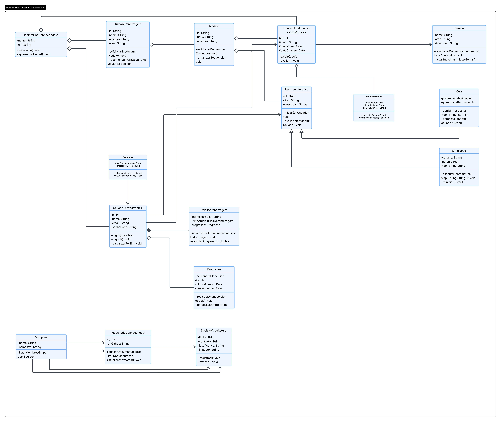

# 2.1.1 Diagrama de Classes 

## Introdução

## Metodologia

## Artefato Produzido

**Autores:** Arthur Fernandes Alencar

## Conclusão

### Referências

> PERES, L. M. UML - Parte 2: Diagramas de Classes. COPPE/UFRJ. Disponível 
em: https://www.inf.ufpr.br/lmperes/2017_2/ci167/uml/uml_parte2_coppe.pdf

### Histórico de Versão

| Versão | Data | Descrição | Autor | Revisor |
| :--- | :--- | :--- | :--- | :--- |
| 1.0 | 22/04/2026 | Criação da imagem do Diagrama de Classes | [Arthur Fernandes](https://github.com/hisarxt) | [João Guilherme](https://github.com/joaoguilherme14) |
