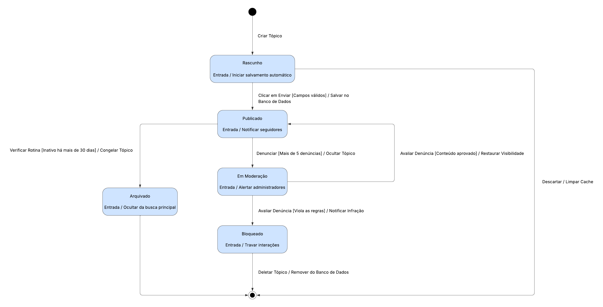

# 2.2.1 Diagrama de Estados (Máquina de Estados)

## Introdução
O Diagrama de Estados (ou Máquina de Estados) é um artefato da modelagem dinâmica da UML utilizado para representar o comportamento de um único objeto ao longo do tempo. Ele ilustra os diferentes estados que uma entidade pode assumir e os gatilhos (eventos) que causam a transição entre eles. 

Para o projeto **ConhecendoIA**, escolhemos mapear o ciclo de vida da entidade central do nosso fórum: o **Tópico de Discussão**. Este diagrama detalha exatamente como o sistema deve reagir desde o momento em que um usuário inicia a redação de um post até o seu eventual arquivamento ou exclusão, garantindo o controle total sobre o conteúdo publicado.

## Metodologia
A modelagem foi desenvolvida utilizando a ferramenta Lucidchart para garantir alta fidelidade visual e alinhamento com a padronização do grupo. Para facilitar a compreensão por todos os stakeholders, utilizamos linguagem natural, mantendo a sintaxe rigorosa de transição da UML: `Evento [Condição de Guarda] / Ação`.

*   **Eventos:** Gatilhos que iniciam a mudança (ex: `Clicar em Enviar`, `Denunciar`).
*   **Condições de Guarda (`[ ]`):** Regras de negócio que devem ser verdadeiras para a transição ocorrer (ex: `[Mais de 5 denúncias]`, `[Campos válidos]`).
*   **Ações (`/`):** Operações executadas pelo sistema durante a transição (ex: `/ Salvar no Banco de Dados`).

Também mapeamos as ações internas (Ações de Entrada) que ocorrem no momento em que a entidade entra em um novo estado, evidenciando as integrações com os sistemas de notificação e moderação.

## Artefato Produzido

**Autores:** Marcos Filho Pereira Quixabeira, ... .

### Legenda do Diagrama
Para garantir a correta interpretação da modelagem, os elementos visuais seguem os padrões da UML 2.5:

*   **Círculo Preto Sólido:** Indica o **Início** ou estado inicial, representando a criação da instância do Tópico.
*   **Retângulos com Bordas Arredondadas:** Representam os **Estados** estáveis em que o objeto se encontra (ex: Publicado, Bloqueado).
*   **Linha Horizontal Interna:** Separa o nome do estado de suas **Ações Internas** (Ações de Entrada), que são executadas automaticamente ao atingir aquele estado.
*   **Setas (Transições):** Mostram o fluxo de movimento entre estados disparado por interações.
*   **Texto nas Setas (`Gatilho [Condição] / Ação`):**
    *   **Gatilho:** Ação externa que solicita a mudança.
    *   **[Condição]:** Regra de validação (guarda) que permite ou bloqueia a transição.
    *   **Ação:** Procedimento técnico executado pelo sistema durante o percurso (ex: remover do banco).
*   **Círculo com Alvo (Bullseye):** Representa o **Fim** ou estado final, indicando que o objeto foi encerrado ou excluído.

## Conclusão
A produção deste Diagrama de Estados com alto nível de detalhamento foi fundamental para o alinhamento da equipe de engenharia. Com ele, concluímos que a implementação do fórum exigirá uma máquina de estados rigorosa na camada de serviço (Backend). 

Fica evidenciado que o sistema não apenas muda "status", mas exige processamentos paralelos — como acionar alertas ao entrar em Moderação, ou validar campos antes de permitir uma publicação. Essa previsibilidade elimina ambiguidades no desenvolvimento, fornecendo um mapa claro das validações que devem ser implementadas para proteger o ecossistema do fórum.

### Referências

> GUEDES, Gilleanes T. A. UML 2.5: Do Requisito à Solução. 3. ed. São Paulo: Érica, 2018.

> PRESSMAN, Roger S.; MAXIM, Bruce R. Engenharia de Software: Uma Abordagem Profissional. 8. ed. Porto Alegre: AMGH, 2016.

### Histórico de Versão

| Versão | Data | Descrição | Autor | Revisor |
| :--- | :--- | :--- | :--- | :--- |
| 1.0 | 22/04/2026 | Criação da documentação detalhada e artefato de Máquina de Estados | [Marcos Quixabeira](https://github.com/marcosfilhopq) | [João Guilherme](https://github.com/joaoguilherme14) |