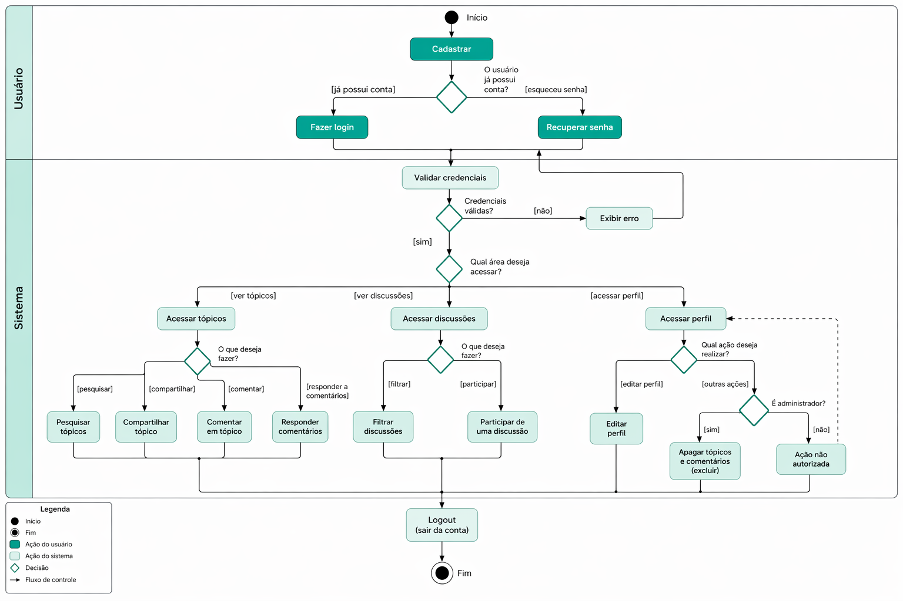

# 2.2.2 Diagrama de Atividades

### Introdução

O **Diagrama de Atividades** é um artefato da modelagem dinâmica da UML utilizado para representar o fluxo de controle e a lógica de um processo ou sistema. Ele ilustra a sequência de ações, pontos de decisão e caminhos paralelos que ocorrem durante a execução de uma tarefa específica.

Para o projeto **ConhecendoIA**, escolhemos mapear o fluxo de **Realização de Atividades Práticas**. Este diagrama detalha exatamente as etapas que o estudante percorre desde a escolha de um tema de IA (como **Redes Neurais**) até a validação de sua resposta e atualização de seu progresso, garantindo que a jornada educativa seja fluida, coerente e devidamente registrada no sistema.

### Metodologia

### Artefatos produzidos

**Autores**: Mariana Pereira da Silva

### Conclusão

### Referências

> UML DIAGRAMS. Activity Diagrams. Disponível em: https://www.uml-diagrams.org/activity-diagrams.html. Acesso em: 22 abr. 2026.

> FOWLER, Martin. UML Distilled: A Brief Guide to the Standard Object Modeling Language. 3. ed. Boston: Addison-Wesley, 2003. Acesso em: 22 abr. 2026.

### Histórico de Versão

| Versão | Data | Descrição | Autor | Revisor |
| :--- | :--- | :--- | :--- | :--- |
| 1.0 | 22/04/2026 | Criação da diagrama de atividades | [Mariana Pereira](https://github.com/marianaps2701) |  |
| 1.0 | 22/04/2026 | Criação da diagrama de atividades | [Arthur Fernandes](https://github.com/hisarxt)      |  |
