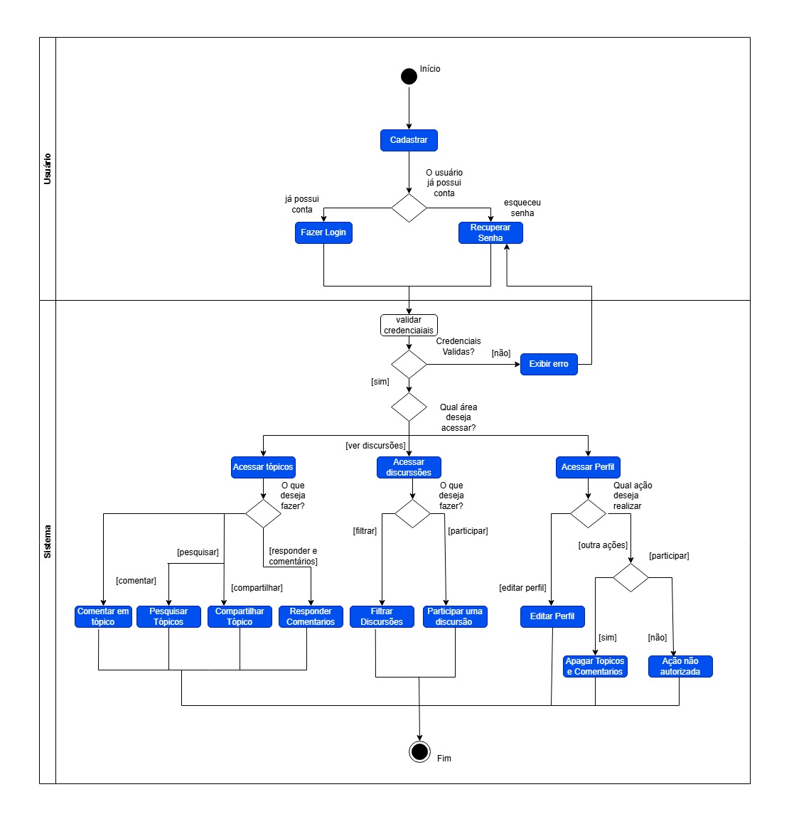

# 2.2.2 Diagrama de Atividades

## Introdução

O **Diagrama de Atividades** é um artefato da modelagem dinâmica da UML utilizado para representar o fluxo de controle e a lógica de um processo ou sistema. Ele ilustra a sequência de ações, pontos de decisão e caminhos paralelos que ocorrem durante a execução de uma tarefa específica.

Para o projeto **ConhecendoIA**, escolhemos mapear o fluxo de **Realização de Atividades Práticas**. Este diagrama detalha exatamente as etapas que o estudante percorre desde a escolha de um tema de IA (como **Redes Neurais**) até a validação de sua resposta e atualização de seu progresso, garantindo que a jornada educativa seja fluida, coerente e devidamente registrada no sistema.

## Metodologia

Para a elaboração deste Diagrama de Atividades, adotou-se uma abordagem focada no sequenciamento lógico das ações do usuário, mapeando passo a passo a sua jornada desde a entrada no site até o engajamento com o conteúdo. O foco do fluxo modelado foi a jornada principal de Descoberta e Interação com um Tópico, que engloba a passagem por múltiplas páginas do sistema.

**Passo a Passo**

- **Definição do Ponto de Partida:** O fluxo inicia quando o usuário acessa a página Home do fórum.
- **Mapeamento de Decisões e Caminhos Alternativos:** Inseriu-se pontos de decisão onde o usuário escolhe como deseja encontrar conteúdo: filtrando pelas categorias de IA (como Machine Learning ou Data Science), visualizando o Trending Topic fixado, ou navegando para a página de Discussions para ver o histórico completo.
- **Detalhamento das Ações Simultâneas:** O processo de entrar na página de um Tópico se desdobra em ações que podem ser feitas paralelamente (ler o conteúdo, ver o autor, dar like, compartilhar ou escrever um comentário).
- **Encerramento do Fluxo:** O diagrama é finalizado quando o usuário conclui sua interação (ex: envia o comentário) e retorna à navegação ou acessa seu Perfil para verificar suas estatísticas atualizadas.

**Legenda**

 
Para a correta leitura do diagrama elaborado, a seguinte simbologia da notação UML foi utilizada:
 
| Símbolo | Nome | Descrição |
|:---:|:---|:---|
| ● | No Inicial | Representa o ponto de início do fluxo de atividades. É simbolizado por um círculo preenchido em preto. |
| ◉ | No Final | Indica o término do fluxo de atividades. É representado por um círculo preenchido em preto dentro de outro círculo. |
| `Activity` | Atividade | Representa uma ação ou tarefa específica no fluxo. É simbolizada por um retângulo com bordas arredondadas contendo a descrição da ação. |
| ——→ | Conector | Mostra o fluxo de direção, ou fluxo de controle, da atividade. |
| ◇ | No de Decisão | Indica um ponto de decisão no fluxo onde diferentes caminhos podem ser tomados. É representado por um losango. |
| ━┳━ | Barra de Sincronização | Representa um ponto onde o fluxo pode se dividir em atividades paralelas (fork) ou se juntar novamente (join). É simbolizada por uma barra preta horizontal. |
| `[Condition]` | Texto de Condição | Representa a regra ou condição que determina qual caminho o fluxo deve seguir quando encontra um ponto de decisão. É escrito ao lado da linha que sai do losango de decisão. |

## Artefato Produzido

**Autores:** [Mariana Pereira da Silva](https://github.com/marianaps2701), [Davi Rodrigues Nunes](https://github.com/davirnunes), [Vinícius Ribeiro](https://github.com/viniiribeiro), [Ingrid Alves](https://github.com/alvesingrid), [Arthur Fernandes](https://github.com/hisarxt), 2026

## Conclusão

A produção deste Diagrama de Atividades permite concluir que a arquitetura de navegação do fórum de IA é projetada para ser altamente fluida e orientada ao engajamento. O mapeamento do fluxo revela que não existem "becos sem saída" na interface; o usuário dispõe de múltiplos caminhos eficientes (seja pelos filtros da Home ou pela listagem em Discussions) para alcançar o objetivo principal: consumir e debater o conteúdo. Além disso, a visualização das ações na página de Tópico demonstra que o sistema facilita interações rápidas e simultâneas (curtir, compartilhar e comentar), o que é vital para manter a dinamicidade de uma comunidade focada em temas complexos como Redes Neurais e Ciência de Dados.

### Referências

> UML DIAGRAMS. Activity Diagrams. Disponível 
em: https://www.uml-diagrams.org/activity-diagrams.html. Acesso em: 22 abr. 2026.

> FOWLER, Martin. UML Distilled: A Brief Guide to the Standard Object Modeling Language. 3. ed. Boston: Addison-Wesley, 2003. Acesso em: 22 abr. 2026.

### Histórico de Versão

| Versão | Data | Descrição | Autor | Revisor |
| :--- | :--- | :--- | :--- | :--- |
| 1.0 | 22/04/2026 | Criação da diagrama de atividades | [Mariana Pereira](https://github.com/marianaps2701) | [Vinícius Ribeiro](https://github.com/viniiribeiro) |
| 1.0 | 22/04/2026 | Criação da diagrama de atividades | [Arthur Fernandes](https://github.com/hisarxt)      | [Vinícius Ribeiro](https://github.com/viniiribeiro) |
| 1.1    | 23/04/2026 | Refatoração estrutural e melhoria do diagrama (draw.io) |[Davi Rodrigues Nunes](https://github.com/davirnunes)||