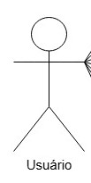
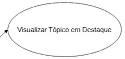
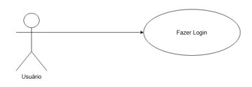
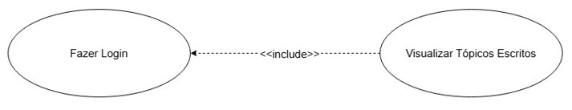
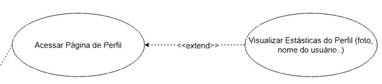

# 2.3.1 Diagrama de Casos de Uso

## Introdução

O Diagrama de Casos de Uso, um dos artefatos mais conhecidos da UML (Unified Modeling Language), é uma representação visual que descreve como os usuários (chamados de "atores") interagem com um sistema para alcançar objetivos específicos. Ele não se preocupa com como o sistema faz algo internamente ou com sua interface gráfica, mas sim com o que o sistema faz a partir da perspectiva de quem o utiliza.

Sua importância é fundamental no ciclo de vida do desenvolvimento de software, pois serve como a ponte perfeita entre a equipe técnica (desenvolvedores, arquitetos) e os stakeholders (clientes, gestores). Por ser altamente intuitivo, ele garante que todos tenham o mesmo entendimento sobre o escopo do projeto, ajudando a validar requisitos e a evitar a construção de funcionalidades que não entregam valor real aos usuários do fórum "Conhecendo IA".

## Metodologia

A criação do modelo de Casos de Uso para o ecossistema "Conhecendo IA" seguiu uma abordagem estruturada para garantir que todas as vertentes levantadas nas etapas de Design Sprint e Mapa Mental fossem contempladas.

O primeiro passo foi mapear quem ou o que interage com a plataforma. Definimos dois atores principais: o Membro (Usuário Autenticado), que consome conteúdo e interage na comunidade, e o Administrador, responsável por manter a saúde e a qualidade da plataforma.

Com os atores definidos, listamos as ações principais que cada um realiza no sistema, traduzindo as funcionalidades (ex: Fórum, IDE Python, Dashboard) em verbos de ação (ex: "Criar Tópico", "Executar Código", "Analisar Métricas").

Por fim, conectamos os atores aos casos de uso e identificamos dependências lógicas entre as ações, como passos obrigatórios ou opcionais.

## Legenda

### Atores 

Representa um papel desempenhado por um usuário humano ou sistema externo que interage com o nosso software.

### Casos de Uso

Representa uma funcionalidade ou objetivo específico que o sistema fornece ao ator (ex: "Escrever Comentário").

### Relacionamentos

 - Linha Sólida (Associação): Conecta o ator ao caso de uso que 
 ele executa.

 - Seta Tracejada com `<<include>>`: Indica que um caso de uso é obrigatório para que outro aconteça (ex: Para "Criar Tópico", é obrigatório `<<include>>` "Fazer Login").

 - Seta Tracejada com `<<extend>>`: Indica um comportamento opcional ou alternativo que expande um caso de uso base (ex: "Compartilhar Tópico" é uma extensão opcional de "Visualizar Tópico").

## Diagrama de Casos de Uso: Conhecendo IA

Abaixo está a representação visual do escopo de interações do seu projeto.

**Autores:** João Guilherme Fonseca, João Guilherme Capozzi, Guilherme Gusmão, Caio Vilas Boas, Arthur Fernandes.

## Conclusão

A produção deste Diagrama de Casos de Uso solidifica a transição do "Conhecendo IA" de uma ideia conceitual para um escopo de engenharia executável.

Podemos concluir, a partir dessa modelagem, que o sistema possui uma arquitetura de interação bem definida e dividida em responsabilidades claras. A separação entre as ações do Membro (focadas em aprendizado, gamificação e interação social) e as ações do Administrador (focadas em curadoria e análise de dados) garante que a plataforma seja não apenas um espaço dinâmico para os entusiastas de Inteligência Artificial, mas também um ambiente sustentável e gerenciável a longo prazo.

Além disso, esse artefato agora fornece a base necessária para que a equipe de desenvolvimento possa estimar prazos, priorizar o backlog de entregas (criando as funcionalidades vitais primeiro) e iniciar a escrita detalhada dos requisitos técnicos e testes de software.

## Referências

> Sommerville, I. (2019). Engenharia de Software (10ª ed.). Pearson. 

> Booch, G., Rumbaugh, J., & Jacobson, I. (2005). The Unified Modeling Language User Guide (2ª ed.). Addison-Wesley Professional.

> Wiegers, K., & Beatty, J. (2013). Software Requirements (3ª ed.). Microsoft Press.

### Histórico de Versão

| Versão | Data | Descrição | Autor | Revisor |
| :--- | :--- | :--- | :--- | :--- |
| 1.0 | 23/04/2026 | Criação da documentação detalhada | [João Fonseca](https://github.com/joaoguilherme14) | [João Capozzi](https://github.com/jonas3688) |
| 1.1 | 23/04/2026 | Inserção das imagens do Diagrama e das legendas | [João Capozzi](https://github.com/jonas3688) | [Arthur Fernandes](https://github.com/hisarxt) |
| 1.2 | 23/04/2026 | Inserção das imagens explicativas sobre o Diagrama | [Arthur Fernandes](https://github.com/hisarxt) | [João Capozzi](https://github.com/jonas3688) |
