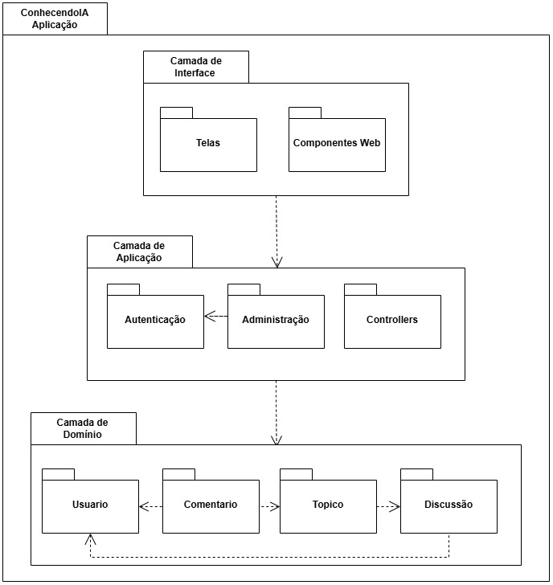

# 2.3.2 Diagrama de Pacotes

## Introdução

O Diagrama de Casos de Uso é uma das ferramentas mais fundamentais da UML (Unified Modeling Language). Ele tem como objetivo principal descrever as funcionalidades que um sistema oferece e como os atores (usuários ou sistemas externos) interagem com essas funcionalidades. Sua importância reside na capacidade de fornecer uma visão de alto nível do comportamento do sistema sem entrar em detalhes técnicos de implementação, facilitando a comunicação entre desenvolvedores e interessados no projeto. Ele garante que todos os requisitos funcionais, como a filtragem de discussões por categorias de Data Science ou a criação de novos tópicos, sejam contemplados na arquitetura do software.

## Metodologia

Para a elaboração deste diagrama, seguiu-se uma abordagem centrada na jornada do usuário através das quatro páginas principais do fórum.

**Passo a Passo:**

- **Identificação do Ator:** Definiu-se o "Usuário do Fórum" como o ator principal que interage com a interface.
- **Levantamento de Requisitos:** Foram mapeadas as ações descritas para as páginas Home, Discussions, Topic e Profile.
- **Agrupamento por Contexto:** As funcionalidades foram organizadas de forma que representassem os fluxos de navegação (ex: para comentar, é necessário estar na página do tópico).
- **Definição de Relacionamentos:** Utilizou-se associações diretas entre o ator e as funcionalidades específicas.

**Legenda:**

- **Ator (Boneco):** Representa o usuário que interage com o sistema.
- **Elipse (Caso de Uso):** Representa uma funcionalidade ou ação específica que o usuário pode realizar (ex: "Filtrar por Popularidade").
- **Retângulo (Fronteira do Sistema):** Delimita o escopo do site do fórum de IA.
- **Linhas:** Indicam a interação entre o usuário e a funcionalidade.

## Artefato Produzido

**Autores:** Mariana Pereira da Silva, Guilherme Gusmão

## Conclusão

A produção do Diagrama de Casos de Uso permite concluir que o sistema do fórum possui um fluxo de interação robusto e bem segmentado. Fica claro que o projeto não é apenas um repositório de texto, mas um ecossistema social onde a gamificação (através de likes e contagem de comentários no perfil) e a organização (filtros e categorias como Neural Networks e Deep Learning) são pilares fundamentais. Este artefato serve como o mapa definitivo para a fase de desenvolvimento, garantindo que a experiência do usuário seja fluida desde o primeiro contato na Home até o acompanhamento de sua reputação na página de Perfil.

### Referências

> Checkland, P., & Scholes, J. (1990). Soft Systems Methodology in Action. John Wiley & Sons. Uso no projeto: Referência primária para justificar a criação e a estrutura visual do diagrama Rich Picture. Disponível 
em: https://l1nk.dev/ttm2exi

> Fowler, M. (2003). UML Distilled: A Brief Guide to the Standard Object Modeling Language. Addison-Wesley Professional. Uso no projeto: O guia definitivo e prático para a construção correta do Diagrama de Casos de Uso e as regras de interação entre usuário e sistema. Disponível 
em: https://martinfowler.com/books/uml.html

### Histórico de Versão

| Versão | Data | Descrição | Autor | Revisor |
| :--- | :--- | :--- | :--- | :--- |
| 1.0 | 23/04/2026 | Criação da diagrama de pacotes | [Mariana Pereira](https://github.com/marianaps2701) 
| 1.0 | 23/04/2026 | Descrição do Diagrama de pacotes | [Guilherme Gusmão](https://github.com/gusmoles) |  |