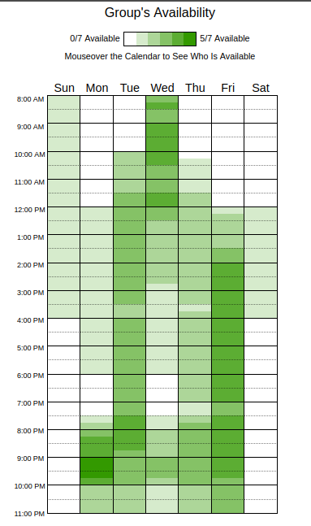

# 2.5.3. Heatmap
 
### Introdução

É uma técnica de visualização de dados que utiliza cores para representar a intensidade de valores em uma determinada área geográfica ou interface digital. Nesse caso é uma forma visual utilizada para representar a frequência de disponibilidade ao longo da semana. Destacando os períodos mais favoráveis com cores mais intensas, facilitando assim que o grupo encontre o melhor horário e o dia para se reunirem.

### Metodologia
Para facilitar a organização das reuniões, foi utilizado o site When2meet, que basicamente é uma ferramenta simples e eficiente onde cada integrante do grupo coloca os horários que estariam disponíveis ao longo da semana, com todas as respostas é gerado um Heatmap final destacando com as cores mais fortes onde mais membros estão disponíveis nesses horários, com isso é possível escolher o melhor dia e horário para as reuniões.

**Figura 13: Piscina da Crystal**
Autores: Todos os membros do grupo 03, 2026

### Conclusão
Analisando o Heatmap de disponibilidade para reuniões do grupo, é possível identificar que os horários mais viáveis para os encontros seriam onde o verde está mais forte, isso significa que mais pessoas estariam disponíveis nesses horários facilitando assim a reunião.

### Bibliografia

> When2meet. Disponível em: https://www.when2meet.com/. Acesso em: 09 de abr. de 2025. 

### Histórico de Versão

| Data | Versão | Descrição | Autor(es) | Revisor(es) |
| :--- | :--- | :--- | :--- | :--- |
| 23/04/2026 | 1.0 | Criação do documento Heatmap. | [Ingrid Alves](https://github.com/alvesingrid) |  [Guilherme Gusmão ](https://github.com/gusmoles) |
